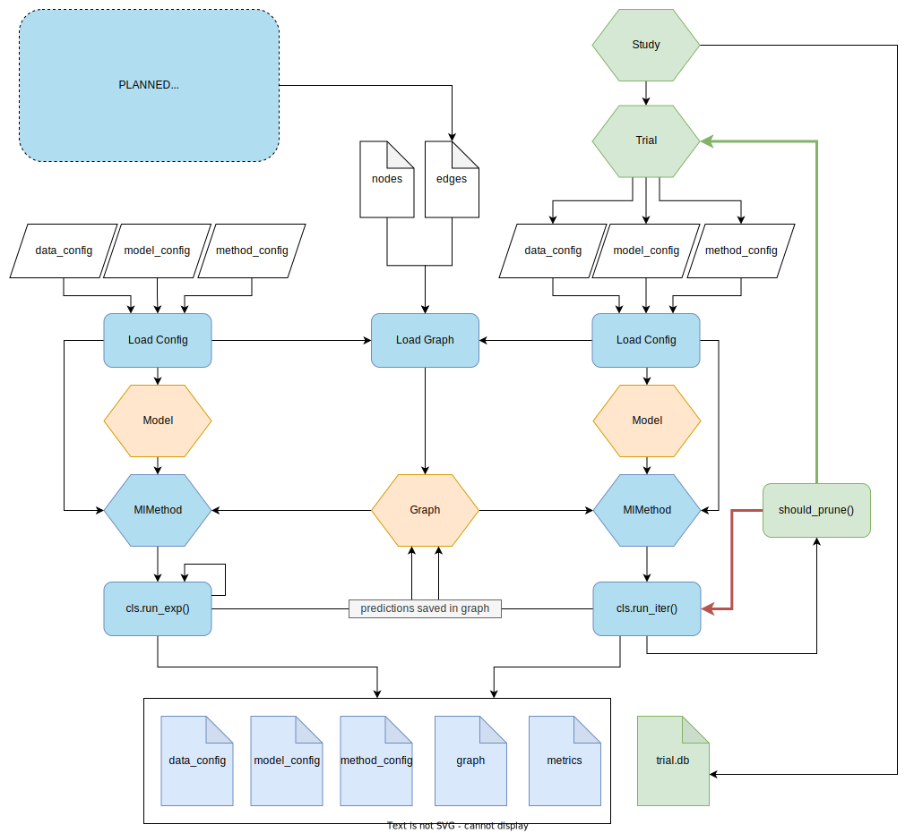

# geo_graphnet
Applying spatial graph construction, and Graph Neural Networks to geophysical interpretation problems. 

### Key Requirements
The default requirements assume windows 64 bit architecture, and pytorch with no CUDA support.

- Python  3.10
- DGL 1.1.1
- torch 2.0.1

# Module Summary

